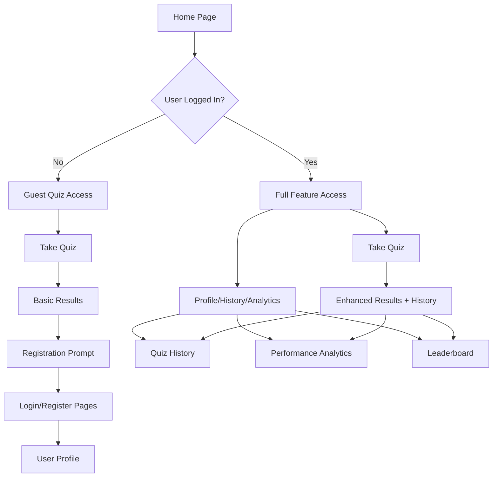

# MPSC Quiz Portal - Feature Integration Product Requirements Document

## 1. Product Overview

The MPSC Quiz Portal is an educational platform designed for aspiring Maharashtra Public Service Commission (MPSC) candidates to practice and improve their exam preparation through interactive quizzes. This document outlines the integration of advanced user management features, analytics, and mobile responsiveness improvements to transform the portal from a simple quiz platform into a comprehensive learning management system.

The enhanced portal will provide personalized learning experiences, progress tracking, competitive elements through leaderboards, and detailed performance analytics to help users identify strengths and areas for improvement.

## 2. Core Features

### 2.1 User Roles

| Role | Registration Method | Core Permissions |
|------|---------------------|------------------|
| Guest User | No registration required | Can take quizzes, view basic results |
| Registered User | Email registration with password | Can save progress, view history, access leaderboards, detailed analytics |
| Admin | System-assigned credentials | Full access to user management, quiz content, system analytics |

### 2.2 Feature Module

Our enhanced MPSC Quiz Portal consists of the following main pages:

1. **Home Page**: Hero section with animated title, quiz category cards, theme toggle, navigation menu
2. **Authentication Pages**: Login form, registration form with validation, password recovery
3. **User Profile Page**: Profile information management, settings, password change functionality
4. **Quiz Interface**: Existing quiz functionality with enhanced user session management
5. **Quiz History Page**: Completed quiz list, scores, review options, filtering capabilities
6. **Performance Analytics Dashboard**: Detailed statistics, charts, progress tracking, topic-wise analysis
7. **Leaderboard Page**: Ranking system, time-based filters (weekly, monthly, all-time), user positioning

### 2.3 Page Details

| Page Name | Module Name | Feature Description |
|-----------|-------------|---------------------|
| Home Page | Header Navigation | Add user menu dropdown, login/logout buttons, responsive navigation |
| Home Page | Theme Toggle | Fix mobile layout collision with title, improve positioning and spacing |
| Home Page | Quiz Cards | Maintain existing quiz links, add user progress indicators for logged-in users |
| Authentication | Login Form | Email/password authentication, floating labels, form validation, "Remember Me" option |
| Authentication | Registration Form | User registration with name, email, password confirmation, terms acceptance |
| Authentication | Password Recovery | Forgot password functionality with email verification |
| User Profile | Profile Management | Edit personal information, upload profile picture, change password |
| User Profile | Account Settings | Theme preferences, notification settings, account deletion option |
| Quiz Interface | Session Management | Save progress for registered users, track completion status |
| Quiz Interface | Enhanced Results | Store results in user history, calculate detailed statistics |
| Quiz History | History List | Display completed quizzes with scores, dates, accuracy percentages |
| Quiz History | Review System | Allow users to review previous quiz attempts, see correct answers |
| Quiz History | Filtering | Filter by date range, quiz type, score range |
| Performance Analytics | KPI Dashboard | Total quizzes taken, average accuracy, time spent, completion rate |
| Performance Analytics | Progress Charts | Daily accuracy breakdown, topic-wise performance visualization |
| Performance Analytics | Trend Analysis | Performance trends over time, improvement suggestions |
| Leaderboard | Ranking System | User rankings based on scores, different time periods (week/month/all-time) |
| Leaderboard | User Positioning | Highlight current user position, show nearby competitors |
| Leaderboard | Achievement System | Badges and achievements for milestones |

## 3. Core Process

### Guest User Flow
1. User visits home page → Selects quiz → Takes quiz → Views basic results → Option to register for enhanced features

### Registered User Flow
1. User visits home page → Logs in (if not already) → Selects quiz → Takes quiz → Results saved to history → Can view analytics and leaderboard

### New User Registration Flow
1. User clicks register → Fills registration form → Email verification → Account created → Redirected to profile setup → Can start taking quizzes

## 4. User Interface Design

### 4.1 Design Style

- **Primary Colors**: Dark theme (#121212 background, #ffffff text), Light theme (#f5f5f5 background, #121212 text)
- **Secondary Colors**: Glass morphism effects with rgba(255,255,255,0.1) overlays, accent colors for success (#22c55e), warning (#f59e0b), danger (#ef4444)
- **Button Style**: Rounded corners (8-16px), glass morphism effects, hover animations with subtle glow
- **Font**: Inter font family, weights 400-700, responsive sizing (base 16px, headings 24-48px)
- **Layout Style**: Card-based design with backdrop blur effects, responsive grid layouts, floating elements
- **Icons**: Material Icons for consistency, custom SVG icons for theme toggle
- **Animations**: Smooth transitions (0.3s ease), typing animation for main title, hover effects with transform and shadow

### 4.2 Page Design Overview

| Page Name | Module Name | UI Elements |
|-----------|-------------|-------------|
| Home Page | Header | Fixed positioning on mobile, improved spacing between title and theme toggle, responsive navigation menu |
| Home Page | Theme Toggle | Repositioned to prevent collision, smooth ball animation, sun/moon icons |
| Authentication | Login Form | Floating label inputs, glass morphism container, glowing button effects |
| Authentication | Register Form | Multi-step validation, animated floating labels, confirmation dialogs |
| Profile | User Avatar | Circular profile image with border, upload functionality, default avatars |
| Profile | Form Fields | Consistent styling with authentication pages, inline validation |
| Analytics | Charts | Interactive bar charts, progress bars with animations, color-coded performance indicators |
| Analytics | KPI Cards | Glass morphism cards with hover effects, percentage change indicators with colors |
| Leaderboard | Ranking List | Medal icons for top 3, highlighted current user row, smooth scrolling |
| History | Quiz Cards | Consistent card design, score badges, review buttons with hover states |

### 4.3 Responsiveness

The application is mobile-first responsive with specific attention to:
- **Mobile (320px-768px)**: Single column layouts, collapsible navigation, optimized touch targets, fixed header spacing
- **Tablet (768px-1024px)**: Two-column layouts where appropriate, maintained card proportions
- **Desktop (1024px+)**: Multi-column layouts, hover effects, larger interactive elements
- **Touch Optimization**: Minimum 44px touch targets, swipe gestures for navigation, optimized form inputs
- **Critical Fix**: Resolve title/theme toggle collision on mobile by adjusting header layout and spacing