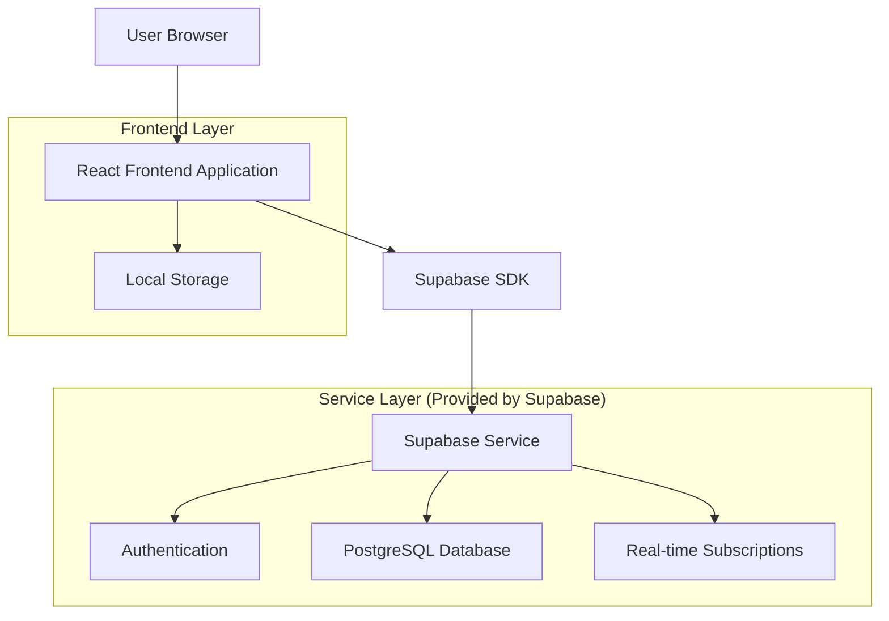

# MPSC Quiz Portal - Technical Architecture Document

## 1. Architecture Design



## 2. Technology Description

- **Frontend**: React@18 + TailwindCSS@3 + Vite
- **Backend**: Supabase (Authentication, Database, Real-time)
- **Styling**: TailwindCSS with custom CSS variables for theming
- **Icons**: Material Icons + Custom SVG
- **Charts**: Custom CSS-based charts with potential Chart.js integration
- **State Management**: React Context + Local Storage for theme persistence

## 3. Route Definitions

| Route | Purpose |
|-------|---------|
| / | Home page with quiz selection and theme toggle |
| /login | User authentication login form |
| /register | New user registration form |
| /profile | User profile management and settings |
| /quiz/:type | Quiz interface with enhanced session management |
| /history | User's completed quiz history with filtering |
| /analytics | Performance analytics dashboard |
| /leaderboard | Global and filtered leaderboards |
| /quiz-review/:id | Review specific quiz attempt with answers |

## 4. API Definitions

### 4.1 Authentication APIs

**User Registration**
```
POST /auth/signup (Supabase)
```

Request:
| Param Name | Param Type | isRequired | Description |
|------------|------------|------------|-------------|
| email | string | true | User's email address |
| password | string | true | User's password (min 6 characters) |
| name | string | true | User's full name |

Response:
| Param Name | Param Type | Description |
|------------|------------|-------------|
| user | object | User object with id, email, created_at |
| session | object | Authentication session token |

**User Login**
```
POST /auth/signin (Supabase)
```

Request:
| Param Name | Param Type | isRequired | Description |
|------------|------------|------------|-------------|
| email | string | true | User's email address |
| password | string | true | User's password |

Response:
| Param Name | Param Type | Description |
|------------|------------|-------------|
| user | object | User object with profile data |
| session | object | Authentication session token |

### 4.2 Quiz Management APIs

**Save Quiz Result**
```
POST /api/quiz-results
```

Request:
| Param Name | Param Type | isRequired | Description |
|------------|------------|------------|-------------|
| quiz_type | string | true | Type of quiz taken |
| score | integer | true | Score